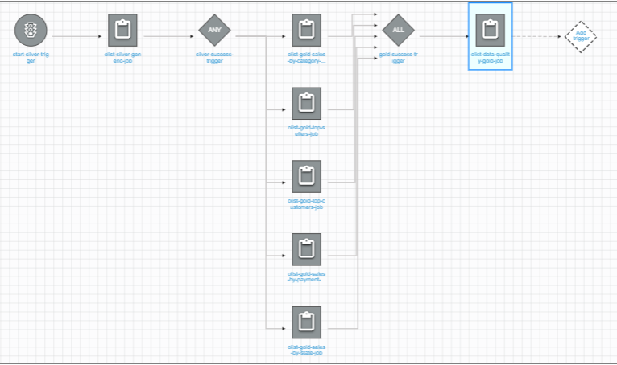
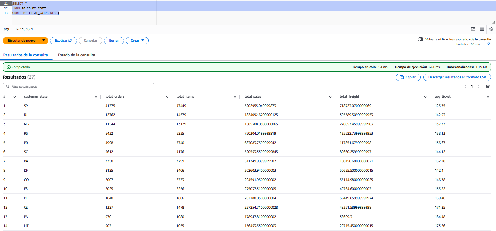
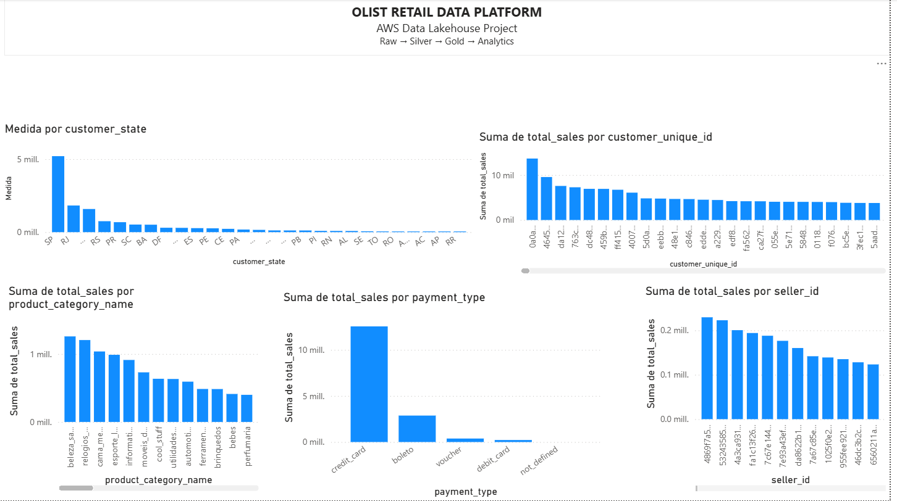

# AWS Retail Data Platform

End-to-end AWS Data Lakehouse project built using Amazon S3, AWS Glue, Athena, PySpark and Power BI.

---

## Project Overview

This project implements a modern Data Lakehouse architecture using AWS services to process and analyze the Olist Brazilian E-Commerce Dataset.
The solution follows a multi-layer architecture:

```text
Raw → Silver → Gold → Analytics
```

The platform ingests raw ecommerce data, standardizes and cleans it through ETL processes, generates business-oriented datasets, and exposes them for analytics through Athena and Power BI.
This project was designed following enterprise Data Engineering practices including layered architecture, workflow orchestration, parallel processing, metadata management, and automated data quality controls.

---

## Key Achievements

- Designed and implemented a complete AWS Data Lakehouse architecture.
- Built automated ETL pipelines using AWS Glue and PySpark.
- Implemented AWS Glue Workflow orchestration with conditional triggers.
- Executed Gold layer aggregations in parallel.
- Implemented automated Data Quality validation with fail-fast pipeline controls.
- Exposed curated datasets through Athena and Power BI.

---

## Architecture


### Data Flow

```text
CSV Files
    ↓
Amazon S3 (Raw Layer)
    ↓
AWS Glue ETL
    ↓
Silver Layer (Parquet)
    ↓
AWS Glue Workflow
    ↓
Gold Aggregations (Parallel Processing)
    ↓
Data Quality Validation
    ↓
AWS Glue Data Catalog
    ↓
Amazon Athena
    ↓
Power BI Dashboard
```

---

## Workflow Orchestration
Implemented an enterprise-style AWS Glue Workflow to automate the complete data pipeline.
```text
Start Trigger
    ↓
Silver ETL Job
    ↓
Conditional Trigger
    ↓
Gold Layer Jobs (Parallel)
      ├── Sales by State
      ├── Sales by Category
      ├── Sales by Payment Type
      ├── Top Customers
      └── Top Sellers
    ↓
ALL Success Trigger
    ↓
Data Quality Validation
```



---

## AWS Services Used

| Service | Purpose |
|----------|----------|
| Amazon S3 | Data Lake Storage |
| AWS Glue ETL | Data Processing |
| AWS Glue Workflow | Pipeline Orchestration |
| AWS Glue Crawlers | Metadata Discovery |
| AWS Glue Catalog | Metadata Management |
| Amazon Athena | Serverless Analytics |
| Amazon CloudWatch | Monitoring & Logging |
| IAM | Security and Access Control |
| Power BI | Reporting & Visualization |

---

## Technologies

- Python
- PySpark
- SQL
- Parquet
- Amazon S3
- AWS Glue
- AWS Athena
- Power BI
- GitHub

---

## Data Layers

### Raw Layer

Stores original source files.

Datasets:

- customers
- orders
- order_items
- products
- payments
- sellers

Storage:

```text
s3://olist-data-engineering-otto/raw/
```

---

### Silver Layer

Standardized and cleansed datasets.

Main transformations:

- Data type standardization
- Null handling
- Data quality validation
- Column normalization
- Parquet optimization

Storage:

```text
s3://olist-data-engineering-otto/silver/
```

---

### Gold Layer

Business-oriented aggregated datasets optimized for analytics.

#### sales_by_state

Sales metrics aggregated by customer state.

Columns:

- customer_state
- total_orders
- total_items
- total_sales
- total_freight
- avg_ticket

---

#### sales_by_category

Sales metrics aggregated by product category.

Columns:

- product_category_name
- total_orders
- total_items
- total_sales
- avg_price

---

#### sales_by_payment_type

Sales metrics aggregated by payment method.

Columns:

- payment_type
- total_orders
- total_sales
- avg_payment_value

---

#### top_sellers

Top performing sellers.

Columns:

- seller_id
- seller_state
- total_orders
- total_items
- total_sales

---

#### top_customers

Top customers by revenue.

Columns:

- customer_unique_id
- customer_state
- total_orders
- total_sales
- avg_ticket

Storage:

```text
s3://olist-data-engineering-otto/gold/
```

---

## Athena Queries

Athena is used as the analytical query layer.

Example:

SQL 



```sql
SELECT *
FROM sales_by_state
ORDER BY total_sales DESC;
```

Query scripts:

```text
sql/queries.sql
```


---

## Power BI Dashboard

The Gold layer datasets are consumed by Power BI for reporting and visualization.

Examples:

- Sales by State
- Sales by Category
- Sales by Payment Type
- Top Sellers
- Top Customers




---

## Project Structure

```text
aws-retail-data-platform
│
├── docs
│   ├── architecture
│   │   └── architecture.png
│   └── project_overview.md
│
├── scripts
│   ├── silver
│   └── gold
│
├── sql
│   └── queries.sql
│
├── powerbi
│   └── dashboard.pbix
│
└── README.md
```

---

## Key Data Engineering Concepts Demonstrated

- Data Lake Architecture
- Lakehouse Architecture
- ETL Pipelines
- PySpark Transformations
- Data Quality Validation
- Data Aggregation
- Parquet Optimization
- AWS Glue Catalog
- Athena Analytics
- Business Metrics Modeling

---

## Features

- AWS Glue Workflow orchestration
- Conditional event-based triggers
- Parallel execution of Gold aggregations
- Automated Data Quality validation
- AWS Glue Crawlers and Data Catalog integration
- Athena query layer for serverless analytics
- End-to-end pipeline automation
- Fail-fast validation strategy
- Enterprise ETL design pattern

---

## Data Quality Controls

Automated validation layer implemented using AWS Glue and PySpark.

### Validation Rules

| Dataset | Validation |
|----------|------------|
| sales_by_state | customer_state NOT NULL |
| sales_by_payment_type | payment_type NOT NULL |
| sales_by_category | product_category_name NOT NULL |
| top_customers | customer_unique_id NOT NULL |
| top_sellers | seller_id NOT NULL |

Pipeline execution fails automatically when a validation rule is violated.

---

## Future Improvements

- CloudWatch Alerts
- SNS Notifications
- Infrastructure as Code (Terraform)
- GitHub Actions CI/CD
- AWS Step Functions orchestration

---

## Dataset

- Brazilian E-Commerce Public Dataset by Olist (Kaggle)

Source:

https://www.kaggle.com/datasets/olistbr/brazilian-ecommerce

---

## Author

Otto Yhoda Alvarez Devars

Senior Data Engineer | Data Governance | PySpark | AWS | Azure | Snowflake

GitHub: https://github.com/yhodiux
