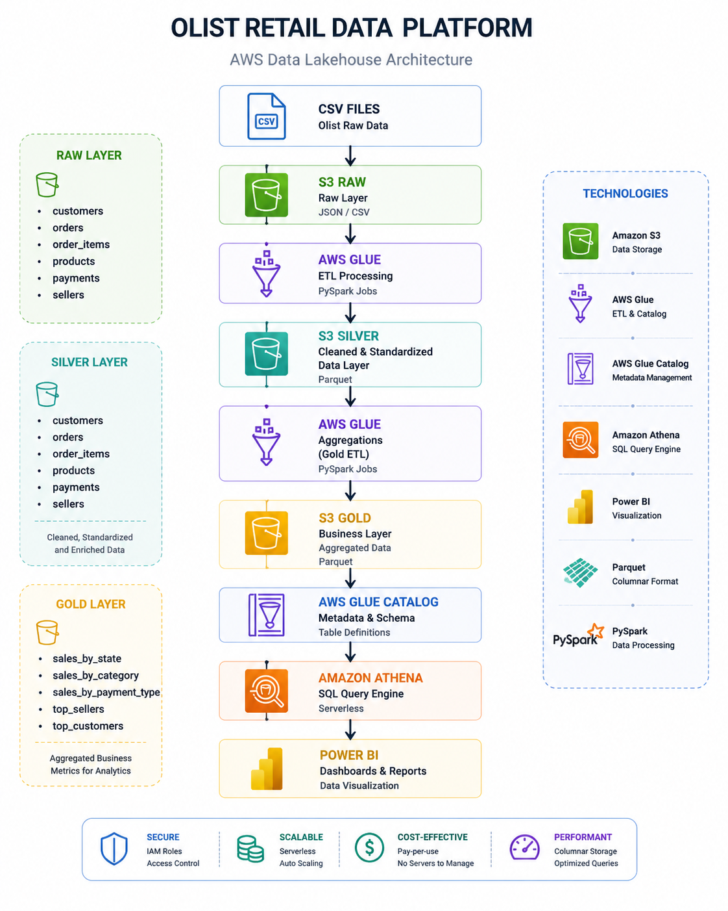
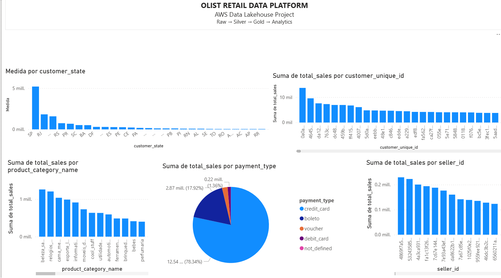

# AWS Retail Data Platform

Portfolio project demonstrating an end-to-end AWS analytics data platform for the public Olist Brazilian ecommerce dataset. It uses a medallion-style data lake on Amazon S3, AWS Glue and PySpark transformations, automated data-quality controls, Athena, and Power BI.

> Repository status: Gold enhancements, explicit Silver schemas, stronger quality controls, and local tests are complete locally. Their consolidated AWS deployment is intentionally deferred. See [project status](docs/project-status.md).

## Documentation

- [Project status and roadmap](docs/project-status.md)
- [Project overview](docs/project_overview.md)
- [Data source and Raw mapping](docs/data-source.md)
- [Silver data contracts](docs/silver-data-contracts.md)
- [Gold data contracts](docs/gold-data-contracts.md)
- [Logical data model](docs/data_model/logical_model.md)
- [Local PySpark testing](docs/testing-guide.md)
- [Manual AWS deployment guide](docs/deployment-guide.md)
- [Final deployment order](docs/deployments/final-deployment-order.md)
- [Repository review](docs/repository-review.md)
- [Change history](CHANGELOG.md)

## Architecture



```text
Olist CSV files
    -> Amazon S3 Raw
    -> AWS Glue Silver ETL
       -> explicit schemas
       -> table-level quality checks
    -> Amazon S3 Silver (Parquet)
    -> Silver referential-integrity job
    -> AWS Glue Gold aggregations (parallel)
    -> Amazon S3 Gold (Parquet)
    -> Gold quality job
    -> AWS Glue Data Catalog
    -> Amazon Athena
    -> Power BI
```

The existing AWS environment also uses Glue Workflow conditional triggers, EventBridge failure events, CloudWatch logs, and SNS email notifications. Screenshots under `docs/screenshots/` provide deployment evidence. A Terraform module under `infra/terraform/` now defines the target infrastructure; importing or applying it in AWS remains pending.

## What this project demonstrates

- Layered Raw, Silver, and Gold data design.
- Reusable AWS Glue/PySpark jobs and shared Python packaging.
- Explicit source schemas instead of runtime inference.
- Fail-fast required-field, uniqueness, domain, range, and non-negative checks.
- Cross-table referential-integrity validation with persistent audit output.
- Backward-compatible Gold metrics plus explicit delivered-order metrics.
- Parallel Gold processing through AWS Glue Workflow.
- Athena reconciliation queries and Power BI consumption.
- Event-driven failure monitoring through EventBridge and SNS.
- Docker-based automated PySpark tests without AWS credentials.

## Data layers

### Raw

Raw preserves the publisher's CSV files unchanged. The source data is not committed to Git.

Registered datasets:

- `customers`
- `orders`
- `order_items`
- `payments`
- `products`
- `sellers`
- `geolocation`
- `reviews`
- `product_category_translation`

The current analytical workflow primarily consumes the first six datasets.

### Silver

The generic Silver job accepts a registered `TABLE_NAME`, reads the corresponding Raw prefix, applies its explicit schema, normalizes strings, executes table-level quality rules, and writes Parquet.

Important design choices:

- ZIP-code prefixes remain strings so leading zeroes are preserved.
- Financial values use `decimal(12,2)`.
- Timestamps use `yyyy-MM-dd HH:mm:ss`.
- Quoted multiline review comments are supported.
- Unknown table names, malformed values, bad headers, empty tables, invalid domains, and duplicate business keys fail the job.
- A separate job checks five core parent-child relationships after all required Silver tables exist.

See [Silver data contracts](docs/silver-data-contracts.md).

### Gold

All existing columns remain available for compatibility with Athena and Power BI. New metrics identify delivered-order semantics explicitly.

| Dataset | Grain | Added analytical coverage |
|---|---|---|
| `sales_by_state` | customer state | delivered orders, items, product revenue, freight, average ticket |
| `sales_by_category` | product category | delivered orders, items, revenue, freight, item average, ticket average |
| `sales_by_payment_type` | payment type | payment records, delivered orders, payment value, record/order averages |
| `top_customers` | customer unique ID and state | delivered payment value, order average, first/last purchase |
| `top_sellers` | seller and state | delivered volume, revenue, freight, averages, first/last sale |

The legacy `total_sales` field is intentionally retained. Its historical meaning differs between item-based and payment-based datasets; new fields such as `delivered_product_revenue` and `delivered_payment_value` remove that ambiguity.

See [Gold data contracts](docs/gold-data-contracts.md).

## Data quality

Silver table-level rules are centralized in `scripts/common/quality_rules.py` and executed before overwrite. Referential results are appended under the Silver quality-log prefix and fail the job when orphan records exist.

Gold validation checks:

- Non-empty outputs.
- Required dimensions.
- Non-negative counts and financial metrics.
- Delivered counts not exceeding legacy totals.
- Valid first/last activity ranges.

Athena reconciliation queries are available in `sql/queries.sql`.

## Reusable Glue package

Shared code is packaged as `libs/common.zip`:

```text
common/
|-- __init__.py
|-- config.py
|-- data_quality.py
|-- gold_transformations.py
|-- logger.py
|-- quality_rules.py
|-- schemas.py
|-- silver_transformations.py
`-- utils.py
```

Rebuild and verify it with:

```powershell
powershell -NoProfile -ExecutionPolicy Bypass -File .\scripts\build_common_zip.ps1
```

The builder emits Linux-compatible ZIP paths required by AWS Glue.

## Local tests

Docker is the only local runtime prerequisite:

```powershell
powershell -NoProfile -ExecutionPolicy Bypass -File .\scripts\run_tests.ps1
```

The pinned Apache Spark 3.5.4 suite currently contains 10 tests covering schemas, Silver normalization, quality failures, referential integrity, and all five Gold transformations. The latest verification completed with 10/10 tests passing.

## AWS services and tools

| Service or tool | Purpose |
|---|---|
| Amazon S3 | Raw, Silver, Gold, and quality-audit storage |
| AWS Glue ETL | PySpark processing |
| AWS Glue Workflow | Conditional orchestration and parallel Gold execution |
| AWS Glue Crawlers and Data Catalog | Metadata discovery and table definitions |
| Amazon Athena | SQL validation and analytics |
| Amazon CloudWatch | Glue execution logs |
| Amazon EventBridge | Glue failure-event routing |
| Amazon SNS | Email failure notifications |
| IAM | Access control |
| Power BI | Dashboard and reporting |
| Docker | Isolated local Spark tests |
| Terraform | Reproducible AWS infrastructure definition |

## Dashboard

The editable dashboard is stored at `powerbi/olist_dashboard.pbix`.



## Repository structure

```text
.
|-- data/                    # ignored local source data and layer placeholders
|-- docs/
|   |-- architecture/
|   |-- data_model/
|   |-- deployments/
|   `-- screenshots/
|-- libs/
|   `-- common.zip
|-- infra/
|   `-- terraform/
|-- powerbi/
|   `-- olist_dashboard.pbix
|-- scripts/
|   |-- common/
|   |-- gold/
|   |-- quality/
|   `-- silver/
|-- sql/
|   `-- queries.sql
|-- tests/
|-- CHANGELOG.md
|-- LICENSE
`-- README.md
```

## Deployment state

The Terraform module is implemented and locally validated, but it has not yet been reconciled with the existing manually managed AWS resources. Local changes are not considered deployed until Terraform state/import decisions and AWS runtime evidence are recorded in `docs/project-status.md`.

Use the [final deployment order](docs/deployments/final-deployment-order.md) rather than deploying individual files ad hoc.

## Dataset

Brazilian E-Commerce Public Dataset by Olist: <https://www.kaggle.com/datasets/olistbr/brazilian-ecommerce>

## Roadmap

- Consolidated manual AWS validation.
- Import or deploy the Terraform-defined infrastructure in AWS.
- CI/CD for syntax, package, and PySpark tests.
- Optional Apache Iceberg evaluation if ACID table capabilities are required.

## Author

Otto Yhoda Alvarez Devars

Senior Data Engineer | Data Governance | PySpark | AWS | Azure | Snowflake

<https://github.com/yhodiux>

## License

See [LICENSE](LICENSE).
