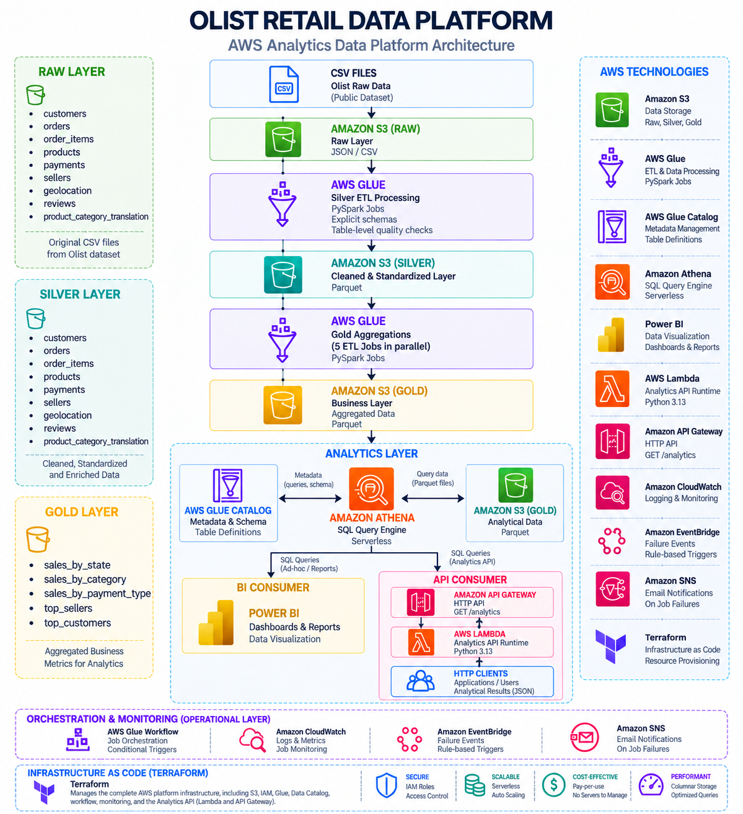
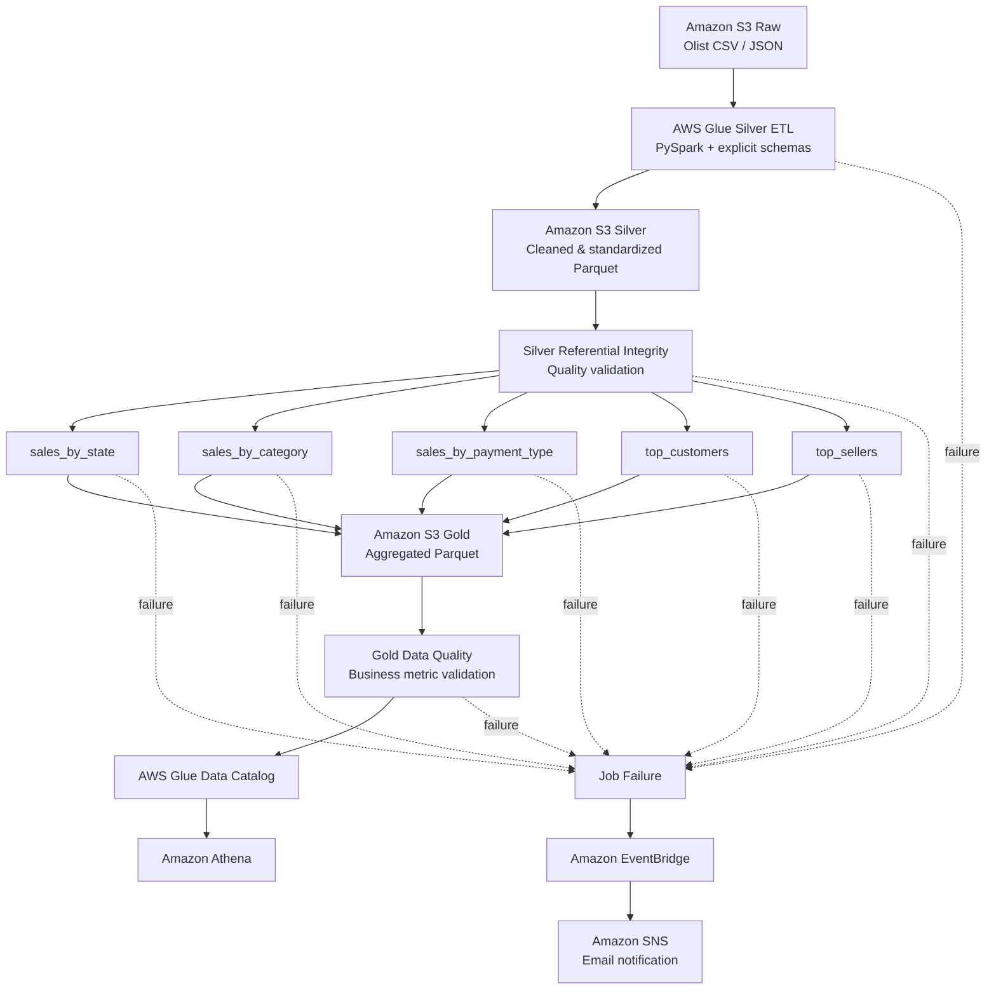
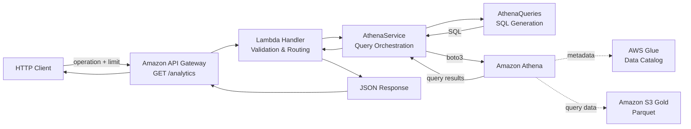
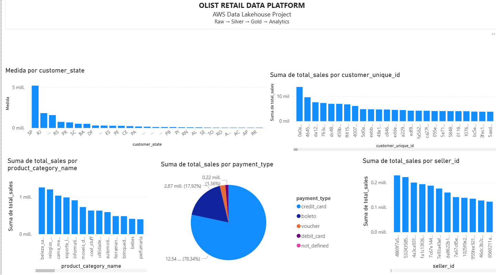

# AWS Retail Data Platform

Portfolio project demonstrating an end-to-end AWS analytics data platform for the public Olist Brazilian ecommerce dataset. It uses a medallion-style data lake on Amazon S3, AWS Glue and PySpark transformations, automated data-quality controls, Athena, and Power BI.

> Repository status: the core AWS data platform is Terraform-managed and has been validated in AWS, including the Silver/Gold workflow, crawlers, Gold quality controls, and supporting infrastructure. See [project status](docs/project-status.md).
>
> Analytics API status: the API under `functions/analytics_api/` is deployed as the `olist-analytics-api-dev` AWS Lambda using Python 3.13 and exposed through an Amazon API Gateway HTTP API. All five Gold analytical operations are implemented, covered by automated tests, and validated through the deployed Lambda. The HTTP path has also been validated end to end through API Gateway, Lambda, Athena, `olist_gold_db`, and S3 Gold data.

## Documentation

- [Project status and roadmap](docs/project-status.md)
- [Project overview](docs/project_overview.md)
- [Data source and Raw mapping](docs/data-source.md)
- [Silver data contracts](docs/silver-data-contracts.md)
- [Gold data contracts](docs/gold-data-contracts.md)
- [Logical data model](docs/data_model/logical_model.md)
- [Analytics API](docs/analytics-api.md)
- [Local PySpark testing](docs/testing-guide.md)
- [Manual AWS deployment guide](docs/deployment-guide.md)
- [Final deployment order](docs/deployments/final-deployment-order.md)
- [Repository review](docs/repository-review.md)
- [Change history](CHANGELOG.md)

## Architecture



```text
Olist CSV files
    -> Amazon S3 Raw
    -> AWS Glue Silver ETL
       -> explicit schemas
       -> table-level quality checks
    -> Amazon S3 Silver (Parquet)
    -> Silver referential-integrity job
    -> AWS Glue Gold aggregations (parallel)
    -> Amazon S3 Gold (Parquet)
    -> Gold quality job
    -> AWS Glue Data Catalog
    -> Amazon Athena
       -> Analytics API
          -> AWS Lambda
          -> Amazon API Gateway HTTP API
    -> Power BI
```

The AWS environment also uses Glue Workflow conditional triggers, EventBridge failure events, CloudWatch logs, and SNS email notifications. Screenshots under `docs/screenshots/` provide deployment evidence. Terraform under `infra/terraform/` manages the active AWS platform infrastructure ...and the Analytics API infrastructure, including AWS Lambda and Amazon API Gateway.

### Data Pipeline & Orchestration

The platform uses an AWS Glue workflow to coordinate the medallion pipeline, with explicit quality gates before analytical consumption.


```mermaid
flowchart TD
    RAW["Amazon S3 Raw<br/>Olist CSV / JSON"]

    SILVER["AWS Glue Silver ETL<br/>PySpark + explicit schemas"]
    SILVER_S3["Amazon S3 Silver<br/>Cleaned & standardized Parquet"]
    RI["Silver Referential Integrity<br/>Quality validation"]

    G1["sales_by_state"]
    G2["sales_by_category"]
    G3["sales_by_payment_type"]
    G4["top_customers"]
    G5["top_sellers"]

    GOLD_S3["Amazon S3 Gold<br/>Aggregated Parquet"]
    GOLD_DQ["Gold Data Quality<br/>Business metric validation"]
    CATALOG["AWS Glue Data Catalog"]
    ATHENA["Amazon Athena"]

    FAILURE["Job Failure"]
    EVENTBRIDGE["Amazon EventBridge"]
    SNS["Amazon SNS<br/>Email notification"]

    RAW --> SILVER
    SILVER --> SILVER_S3
    SILVER_S3 --> RI

    RI --> G1
    RI --> G2
    RI --> G3
    RI --> G4
    RI --> G5

    G1 --> GOLD_S3
    G2 --> GOLD_S3
    G3 --> GOLD_S3
    G4 --> GOLD_S3
    G5 --> GOLD_S3

    GOLD_S3 --> GOLD_DQ
    GOLD_DQ --> CATALOG
    CATALOG --> ATHENA

    SILVER -. failure .-> FAILURE
    RI -. failure .-> FAILURE
    G1 -. failure .-> FAILURE
    G2 -. failure .-> FAILURE
    G3 -. failure .-> FAILURE
    G4 -. failure .-> FAILURE
    G5 -. failure .-> FAILURE
    GOLD_DQ -. failure .-> FAILURE

    FAILURE --> EVENTBRIDGE
    EVENTBRIDGE --> SNS
```

The five Gold aggregation jobs execute independently after the Silver validation stage, allowing analytical datasets to be produced in parallel. Failure events are captured through EventBridge and delivered through SNS notifications.

### Analytics API Request Flow

The Analytics API exposes Gold analytical datasets through a thin serverless API while keeping HTTP routing, business orchestration, and SQL generation separated.


```mermaid
flowchart LR
    CLIENT["HTTP Client"]
    APIGW["Amazon API Gateway<br/>GET /analytics"]
    HANDLER["Lambda Handler<br/>Validation & Routing"]
    SERVICE["AthenaService<br/>Query Orchestration"]
    REPO["AthenaQueries<br/>SQL Generation"]
    ATHENA["Amazon Athena"]
    CATALOG["AWS Glue<br/>Data Catalog"]
    GOLD["Amazon S3 Gold<br/>Parquet"]
    RESULT["JSON Response"]

    CLIENT -->|"operation + limit"| APIGW
    APIGW --> HANDLER
    HANDLER --> SERVICE
    SERVICE --> REPO
    REPO -->|"SQL"| SERVICE
    SERVICE -->|"boto3"| ATHENA

    ATHENA -. metadata .-> CATALOG
    ATHENA -. query data .-> GOLD

    ATHENA -->|"query results"| SERVICE
    SERVICE --> HANDLER
    HANDLER --> RESULT
    RESULT --> APIGW
    APIGW --> CLIENT
```

Supported operations:

` sales_by_state ` · ` sales_by_category ` · ` sales_by_payment_type ` · ` top_customers ` · ` top_sellers `

Requests default to `sales_by_state` and accept a validated `limit` from 1 to 100.

## What this project demonstrates

- Layered Raw, Silver, and Gold data design.
- Reusable AWS Glue/PySpark jobs and shared Python packaging.
- Explicit source schemas instead of runtime inference.
- Fail-fast required-field, uniqueness, domain, range, and non-negative checks.
- Cross-table referential-integrity validation with persistent audit output.
- Backward-compatible Gold metrics plus explicit delivered-order metrics.
- Parallel Gold processing through AWS Glue Workflow.
- Athena reconciliation queries and Power BI consumption.
- Terraform-deployed Analytics API using Amazon API Gateway, AWS Lambda, a Repository -> Service -> Handler pattern, and Athena-backed access to all five Gold analytical datasets.
- Event-driven failure monitoring through EventBridge and SNS.
- Docker-based automated PySpark tests without AWS credentials.

## Data layers

### Raw

Raw preserves the publisher's CSV files unchanged. The source data is not committed to Git.

Registered datasets:

- `customers`
- `orders`
- `order_items`
- `payments`
- `products`
- `sellers`
- `geolocation`
- `reviews`
- `product_category_translation`

The current analytical workflow primarily consumes the first six datasets.

### Silver

The generic Silver job accepts a registered `TABLE_NAME`, reads the corresponding Raw prefix, applies its explicit schema, normalizes strings, executes table-level quality rules, and writes Parquet.

Important design choices:

- ZIP-code prefixes remain strings so leading zeroes are preserved.
- Financial values use `decimal(12,2)`.
- Timestamps use `yyyy-MM-dd HH:mm:ss`.
- Quoted multiline review comments are supported.
- Unknown table names, malformed values, bad headers, empty tables, invalid domains, and duplicate business keys fail the job.
- A separate job checks five core parent-child relationships after all required Silver tables exist.

See [Silver data contracts](docs/silver-data-contracts.md).

### Gold

All existing columns remain available for compatibility with Athena and Power BI. New metrics identify delivered-order semantics explicitly.

| Dataset | Grain | Added analytical coverage |
|---|---|---|
| `sales_by_state` | customer state | delivered orders, items, product revenue, freight, average ticket |
| `sales_by_category` | product category | delivered orders, items, revenue, freight, item average, ticket average |
| `sales_by_payment_type` | payment type | payment records, delivered orders, payment value, record/order averages |
| `top_customers` | customer unique ID and state | delivered payment value, order average, first/last purchase |
| `top_sellers` | seller and state | delivered volume, revenue, freight, averages, first/last sale |

The legacy `total_sales` field is intentionally retained. Its historical meaning differs between item-based and payment-based datasets; new fields such as `delivered_product_revenue` and `delivered_payment_value` remove that ambiguity.

See [Gold data contracts](docs/gold-data-contracts.md).

## Data quality

Silver table-level rules are centralized in `scripts/common/quality_rules.py` and executed before overwrite. Referential results are appended under the Silver quality-log prefix and fail the job when orphan records exist.

Gold validation checks:

- Non-empty outputs.
- Required dimensions.
- Non-negative counts and financial metrics.
- Delivered counts not exceeding legacy totals.
- Valid first/last activity ranges.

Athena reconciliation queries are available in `sql/queries.sql`.

## Reusable Glue package

Shared code is packaged as `libs/common.zip`:

```text
common/
|-- __init__.py
|-- config.py
|-- data_quality.py
|-- gold_transformations.py
|-- logger.py
|-- quality_rules.py
|-- schemas.py
|-- silver_transformations.py
`-- utils.py
```

Rebuild and verify it with:

```powershell
powershell -NoProfile -ExecutionPolicy Bypass -File .\scripts\build_common_zip.ps1
```

The builder emits Linux-compatible ZIP paths required by AWS Glue.

## Local tests

Docker is the only local runtime prerequisite:

```powershell
powershell -NoProfile -ExecutionPolicy Bypass -File .\scripts\run_tests.ps1
```

The pinned Apache Spark 3.5.4 suite currently contains 10 tests covering schemas, Silver normalization, quality failures, referential integrity, and all five Gold transformations. The latest verification completed with 10/10 tests passing.

The Analytics API includes `pytest` tests under `functions/analytics_api/tests/`:

- Repository tests validate SQL generation for all five Gold analytical operations without AWS access.
- Service tests validate analytical delegation and retain real Athena integration coverage.
- Handler tests validate operation routing, default behavior, limit validation, unsupported operations, and API Gateway query parameters.

The current Analytics API suite passes 22/22 tests. All five analytical operations have also been validated through the deployed Lambda, and the HTTP API has been validated end to end through Amazon API Gateway.

## AWS services and tools

| Service or tool | Purpose |
|---|---|
| Amazon S3 | Raw, Silver, Gold, and quality-audit storage |
| AWS Glue ETL | PySpark processing |
| AWS Glue Workflow | Conditional orchestration and parallel Gold execution |
| AWS Glue Crawlers and Data Catalog | Metadata discovery and table definitions |
| Amazon Athena | SQL validation and analytics |
| AWS Lambda | Deployed Analytics API runtime and analytical request routing |
| Amazon API Gateway | Deployed HTTP entry point exposing `GET /analytics` |
| Amazon CloudWatch | Glue execution logs |
| Amazon EventBridge | Glue failure-event routing |
| Amazon SNS | Email failure notifications |
| IAM | Access control |
| Power BI | Dashboard and reporting |
| Docker | Isolated local Spark tests |
| Terraform | Reproducible AWS infrastructure definition |

## Dashboard

The editable dashboard is stored at `powerbi/olist_dashboard.pbix`.



## Repository structure

```text
.
|-- data/                    # ignored local source data and layer placeholders
|-- docs/
|   |-- architecture/
|   |-- data_model/
|   |-- deployments/
|   `-- screenshots/
|-- libs/
|   `-- common.zip
|-- functions/
|   `-- analytics_api/
|-- infra/
|   `-- terraform/
|-- powerbi/
|   `-- olist_dashboard.pbix
|-- scripts/
|   |-- common/
|   |-- gold/
|   |-- quality/
|   `-- silver/
|-- sql/
|   `-- queries.sql
|-- tests/
|-- CHANGELOG.md
|-- LICENSE
`-- README.md
```

## Deployment state

The active AWS platform is managed through Terraform with remote state. Core infrastructure and the Glue workflow have been reconciled and validated in AWS. The Analytics API infrastructure is also Terraform-managed, including Lambda packaging and deployment, IAM permissions, Amazon API Gateway HTTP API, Lambda proxy integration, routing, and invocation permissions. All five analytical operations have been validated through the deployed Lambda, and the HTTP API has been validated end to end. AWS runtime evidence and current implementation status are recorded in `docs/project-status.md`.

Use the [final deployment order](docs/deployments/final-deployment-order.md) rather than deploying individual files ad hoc.

## Dataset

Brazilian E-Commerce Public Dataset by Olist: <https://www.kaggle.com/datasets/olistbr/brazilian-ecommerce>

## Roadmap

- Complete remaining downstream validation and Power BI refresh checks.
- Add authentication and authorization if the Analytics API is exposed beyond controlled development use.
- Add API-specific observability, structured logging, metrics, and alarms.
- Add throttling and usage controls where appropriate.
- Add CI/CD for syntax, package, PySpark, Analytics API tests, and post-deployment smoke tests.
- Optional Apache Iceberg evaluation if ACID table capabilities are required.

## Author

Otto Yhoda Alvarez Devars

Senior Data Engineer | Data Governance | PySpark | AWS | Azure | Snowflake

<https://github.com/yhodiux>

## License

See [LICENSE](LICENSE).
