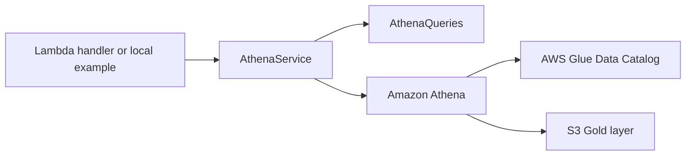

# Analytics API

The Analytics API is an in-progress AWS Lambda component that will expose analytical results produced by the AWS Retail Data Platform.

This component belongs to this repository only. It is not currently part of ALCAZ, although it may later serve as a technical base for that ecosystem.

## Current objective

Provide a thin API layer over the Gold analytical datasets by encapsulating Athena access behind Python services.

The current implementation focuses on local development and validation before Lambda deployment.

## Location

```text
functions/analytics_api/
|-- examples/
|   `-- run_sales_by_state.py
|-- repositories/
|   `-- athena_queries.py
|-- services/
|   `-- athena_service.py
|-- tests/
|   |-- repositories/
|   |   `-- test_athena_queries.py
|   `-- services/
|       `-- test_athena_service.py
|-- utils/
|-- config.py
|-- handler.py
`-- requirements.txt
```

## Architectural pattern

The component follows a `Repository -> Service -> Handler` pattern.



| Layer | Responsibility | Current status |
|---|---|---|
| Repository | Build SQL queries only. It does not execute queries or call AWS services. | `AthenaQueries.sales_by_state()` implemented. |
| Service | Encapsulate communication with Athena through `boto3`. | Query execution, polling, result retrieval, and query orchestration implemented. |
| Handler | Lambda entry point. It should remain thin and avoid business logic. | In construction; not deployed. |

## Implemented components

### AthenaQueries

`AthenaQueries` is responsible only for SQL generation.

Current query:

- `sales_by_state()`

It does not execute SQL and does not depend on AWS credentials.

### AthenaService

`AthenaService` owns the integration with Amazon Athena.

Current methods:

- `execute_query()`
- `wait_for_completion()`
- `get_results()`
- `run_query()`

The service is intended to fully hide Athena communication details from API consumers.

Future business methods are planned here, including:

- `sales_by_state()`
- `top_customers()`
- `top_sellers()`
- `sales_by_category()`
- `sales_by_payment_type()`

## Testing

The Analytics API uses `pytest`.

### Unit tests

Location:

```text
functions/analytics_api/tests/repositories/test_athena_queries.py
```

Purpose:

- Validate SQL generation.
- Avoid AWS calls.
- Keep repository tests deterministic and fast.

### Integration tests

Location:

```text
functions/analytics_api/tests/services/test_athena_service.py
```

Purpose:

- Validate the full integration path from Python to Athena.
- Exercise `boto3`, Amazon Athena, the AWS Glue Data Catalog, S3 Gold data, and Athena result retrieval.

This integration test has been executed successfully in the current development environment.

## Local example

The local execution example is:

```text
functions/analytics_api/examples/run_sales_by_state.py
```

It demonstrates how to consume the service from Python before deploying the Lambda function.

## Current capabilities

At this stage, the project can:

- Generate analytical SQL.
- Execute Athena queries.
- Retrieve Athena results from the configured result location.
- Validate repository and service behavior through automated tests.

The Analytics API is not yet deployed and is not yet integrated with API Gateway.

## Roadmap

Planned work, not yet implemented:

- Complete `AthenaService` with business methods.
- Finalize the Lambda handler.
- Integrate API Gateway.
- Automate deployment with Terraform.
- Add final technical documentation and diagrams after deployment.
