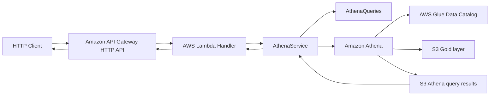

# Analytics API

The Analytics API is an AWS Lambda and Amazon API Gateway component that exposes analytical results produced by the AWS Retail Data Platform through Amazon Athena.

This component belongs to this repository only. It is not currently part of ALCAZ, although it may later serve as a technical base for that ecosystem.

## Current objective

Provide a thin HTTP API layer over the Gold analytical datasets by encapsulating Athena access behind Python Repository, Service, and Handler layers.

The current implementation is deployed in AWS, supports all five Gold analytical datasets, and has been validated end to end through both direct Lambda invocation and Amazon API Gateway.

## Location

```text
functions/analytics_api/
|-- examples/
|   `-- run_sales_by_state.py
|-- repositories/
|   `-- athena_queries.py
|-- services/
|   `-- athena_service.py
|-- tests/
|   |-- handler/
|   |   `-- test_handler.py
|   |-- repositories/
|   |   `-- test_athena_queries.py
|   `-- services/
|       `-- test_athena_service.py
|-- utils/
|   `-- response.py
|-- config.py
|-- handler.py
`-- requirements.txt
```

## Architecture

The component follows a `Repository -> Service -> Handler` pattern and is exposed through Amazon API Gateway HTTP API.


```mermaid
flowchart LR
    Client[HTTP Client]
    Gateway[Amazon API Gateway HTTP API]
    Handler[AWS Lambda Handler]
    Service[AthenaService]
    Repository[AthenaQueries]
    Athena[Amazon Athena]
    Catalog[AWS Glue Data Catalog]
    Gold[S3 Gold layer]
    Results[S3 Athena query results]

    Client --> Gateway
    Gateway --> Handler
    Handler --> Service
    Service --> Repository
    Service --> Athena
    Athena --> Catalog
    Athena --> Gold
    Athena --> Results
    Results --> Service
    Service --> Handler
    Handler --> Gateway
    Gateway --> Client
```

| Layer | Responsibility | Current status |
|---|---|---|
| Repository | Build analytical SQL without executing queries or calling AWS services. | Five Gold analytical queries implemented and tested. |
| Service | Encapsulate Athena execution through `boto3`, including polling and result retrieval. | Core Athena integration and five analytical business methods implemented. |
| Handler | Validate input, route analytical operations, delegate to the service layer, and format responses. | Implemented, tested, deployed, and validated. |
| API Gateway | Expose the Lambda through an HTTP endpoint. | HTTP API deployed and validated through `GET /analytics`. |

## Supported analytical operations

The API currently supports:

- `sales_by_state`
- `sales_by_category`
- `sales_by_payment_type`
- `top_customers`
- `top_sellers`

If no operation is supplied, the API defaults to:

```text
sales_by_state
```

Each operation accepts an optional `limit`.

Valid limits are:

```text
1..100
```

The default is:

```text
10
```

## AthenaQueries

`AthenaQueries` is responsible only for SQL generation.

Implemented methods:

- `sales_by_state()`
- `sales_by_category()`
- `sales_by_payment_type()`
- `top_customers()`
- `top_sellers()`

The Repository layer does not execute SQL and does not require AWS credentials.

## AthenaService

`AthenaService` owns communication with Amazon Athena.

Core integration methods include:

- `execute_query()`
- `wait_for_completion()`
- `get_results()`
- `run_query()`

Analytical business methods include:

- `sales_by_state()`
- `sales_by_category()`
- `sales_by_payment_type()`
- `top_customers()`
- `top_sellers()`

Each analytical method delegates SQL generation to `AthenaQueries` and query execution to the shared Athena integration logic.

## Lambda handler

`handler.py` is the AWS Lambda entry point.

The handler remains intentionally thin. Its responsibilities are:

1. Read the requested analytical operation.
2. Read and validate the result limit.
3. Select the corresponding `AthenaService` method.
4. Delegate execution to the service layer.
5. Return a JSON HTTP response.

The handler supports both direct Lambda events and Amazon API Gateway HTTP API query parameters.

### Direct Lambda event

Example:

```json
{
  "operation": "top_sellers",
  "limit": 5
}
```

An empty direct event remains backward compatible:

```json
{}
```

and executes `sales_by_state` with the default limit.

### HTTP query parameters

Example request:

```text
GET /analytics?operation=top_sellers&limit=5
```

Input validation returns HTTP-style `400` responses for:

- Unsupported operations.
- Non-integer limits.
- Limits below 1.
- Limits above 100.

Response formatting is centralized in:

```text
functions/analytics_api/utils/response.py
```

## Testing

The Analytics API uses `pytest`.

Tests are organized under:

```text
functions/analytics_api/tests/
```

Current automated coverage contains 22 passing tests across Repository, Service, and Handler behavior.

### Repository tests

Location:

```text
functions/analytics_api/tests/repositories/test_athena_queries.py
```

Purpose:

- Validate SQL generation for all five Gold analytical operations.
- Avoid AWS calls.
- Keep Repository tests deterministic and fast.

### Service tests

Location:

```text
functions/analytics_api/tests/services/test_athena_service.py
```

Purpose:

- Validate delegation from analytical business methods to shared Athena execution logic.
- Preserve a real Athena integration test for the service layer.
- Exercise `boto3`, Amazon Athena, AWS Glue Data Catalog, S3 Gold data, and Athena result retrieval.

### Handler tests

Location:

```text
functions/analytics_api/tests/handler/test_handler.py
```

Purpose:

- Validate default routing.
- Validate all supported analytical operations.
- Validate explicit and default limits.
- Validate invalid limits.
- Validate unsupported operations.
- Validate API Gateway query-string parameter handling.
- Avoid unnecessary AWS calls through mocks.

The complete Analytics API test suite has been executed successfully with:

```text
22 passed
```

## Local execution

The Analytics API can be exercised locally through the service layer and Lambda handler.

A local service example remains available at:

```text
functions/analytics_api/examples/run_sales_by_state.py
```

Local development and automated testing are used before Terraform-managed AWS deployment.

## AWS deployment

The Lambda function is deployed as:

```text
olist-analytics-api-dev
```

Current Lambda configuration:

- Runtime: Python 3.13
- Handler: `handler.lambda_handler`
- Memory: 256 MB
- Timeout: 30 seconds
- Athena database: `olist_gold_db`
- Athena result location: `s3://<data-bucket>/athena/query-results/`

Terraform manages:

- Lambda packaging through the HashiCorp Archive provider.
- Lambda deployment and code updates.
- Lambda IAM role.
- Least-privilege access required for Athena, Glue, S3, and logging.
- Amazon API Gateway HTTP API.
- Lambda proxy integration.
- `GET /analytics` routing.
- Automatic `$default` API Gateway stage deployment.
- API Gateway CORS configuration.
- Permission for API Gateway to invoke the Lambda.
- Analytics API endpoint output.

The Lambda deployment package is generated from:

```text
functions/analytics_api/
```

and excludes local tests, examples, cache directories, and other development-only artifacts.

## HTTP API

Amazon API Gateway exposes the Analytics Lambda through:

```text
GET /analytics
```

Default request:

```text
GET /analytics
```

executes:

```text
sales_by_state
```

Parameterized request example:

```text
GET /analytics?operation=top_sellers&limit=5
```

The API Gateway endpoint is generated and exposed through Terraform output rather than hard-coded into the application documentation.

## End-to-end validation

The deployed system has been validated through both direct AWS Lambda invocation and HTTP requests through API Gateway.

The complete HTTP execution path is:

```text
HTTP Client
    -> Amazon API Gateway
    -> AWS Lambda
    -> handler.py
    -> AthenaService
    -> AthenaQueries
    -> Amazon Athena
    -> AWS Glue Data Catalog
    -> olist_gold_db
    -> S3 Gold data
    -> Athena query results
    -> JSON HTTP response
```

All five analytical operations were successfully invoked against the deployed Lambda:

```text
sales_by_state
sales_by_category
sales_by_payment_type
top_customers
top_sellers
```

The deployed API was also validated through HTTP with:

```text
GET /analytics
```

and a parameterized analytical request:

```text
GET /analytics?operation=top_sellers&limit=5
```

Both returned successful analytical results from the Gold layer.

This validates the complete deployed path from an HTTP client through API Gateway, Lambda, Athena, Glue Data Catalog, S3 Gold data, and back to a JSON response.

## Current capabilities

At this stage, the Analytics API can:

- Generate SQL for all five Gold analytical datasets.
- Execute Athena queries locally and from AWS Lambda.
- Retrieve analytical results from the Gold layer.
- Route requests dynamically to five analytical operations.
- Validate result limits between 1 and 100.
- Support both direct Lambda events and API Gateway query parameters.
- Return Lambda-compatible and HTTP-compatible JSON responses.
- Validate Repository, Service, and Handler behavior through 22 automated tests.
- Package and deploy the Analytics Lambda through Terraform.
- Deploy and manage Amazon API Gateway through Terraform.
- Execute all five analytical operations end to end in AWS.
- Serve analytical results through an HTTP endpoint.

## Roadmap

Potential future enhancements include:

- Add API authentication and authorization.
- Add throttling and usage controls appropriate for public or shared environments.
- Add structured observability and API-specific CloudWatch metrics.
- Add pagination or richer filtering for analytical operations.
- Add API versioning if the external contract evolves.
- Add additional analytical endpoints as new Gold datasets are introduced.
- Add automated CI/CD deployment and post-deployment smoke tests.