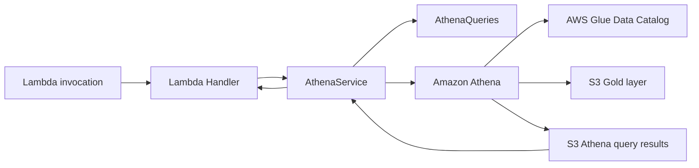

# Analytics API

The Analytics API is an AWS Lambda component that exposes analytical results produced by the AWS Retail Data Platform through Amazon Athena.

This component belongs to this repository only. It is not currently part of ALCAZ, although it may later serve as a technical base for that ecosystem.

## Current objective

Provide a thin API layer over the Gold analytical datasets by encapsulating Athena access behind Python services.

The current implementation has progressed from local development to a deployed AWS Lambda that has been validated end to end against the Gold layer through Amazon Athena.

API Gateway integration and multi-query routing are still pending.

## Location

```text
functions/analytics_api/
|-- examples/
|   `-- run_sales_by_state.py
|-- repositories/
|   `-- athena_queries.py
|-- services/
|   `-- athena_service.py
|-- tests/
|   |-- handler/
|   |   `-- test_handler.py
|   |-- repositories/
|   |   `-- test_athena_queries.py
|   `-- services/
|       `-- test_athena_service.py
|-- utils/
|   `-- response.py
|-- config.py
|-- handler.py
`-- requirements.txt
```

## Architectural pattern

The component follows a `Repository -> Service -> Handler` pattern.


```mermaid
flowchart LR
    Consumer[Lambda invocation]
    Handler[Lambda Handler]
    Service[AthenaService]
    Repository[AthenaQueries]
    Athena[Amazon Athena]
    Catalog[AWS Glue Data Catalog]
    Gold[S3 Gold layer]
    Results[S3 Athena query results]

    Consumer --> Handler
    Handler --> Service
    Service --> Repository
    Service --> Athena
    Athena --> Catalog
    Athena --> Gold
    Athena --> Results
    Results --> Service
    Service --> Handler
```

| Layer | Responsibility | Current status |
|---|---|---|
| Repository | Build SQL queries only. It does not execute queries or call AWS services. | `AthenaQueries.sales_by_state()` implemented. |
| Service | Encapsulate communication with Athena through `boto3`. | Query execution, polling, result retrieval, and `sales_by_state()` orchestration implemented. |
| Handler | Thin AWS Lambda entry point that delegates analytical work to the service layer. | Implemented, tested, deployed, and validated in AWS. |

## Implemented components

### AthenaQueries

`AthenaQueries` is responsible only for SQL generation.

Current query:

- `sales_by_state()`

It does not execute SQL and does not depend on AWS credentials.

### AthenaService

`AthenaService` owns the integration with Amazon Athena.

Current capabilities include:

- Execute Athena queries.
- Poll query execution until completion.
- Retrieve Athena results.
- Orchestrate the `sales_by_state()` analytical query.

Additional business methods are planned for:

- `top_customers()`
- `top_sellers()`
- `sales_by_category()`
- `sales_by_payment_type()`

### Lambda handler

`handler.py` is the AWS Lambda entry point.

The handler remains intentionally thin:

1. Instantiate the service layer.
2. Execute the current `sales_by_state()` operation.
3. Return a JSON HTTP-style response.

Response formatting is centralized in:

```text
functions/analytics_api/utils/response.py
```

The handler has been validated both locally and through a real AWS Lambda invocation.

## Testing

The Analytics API uses `pytest`.

Current automated coverage includes three tests:

```text
functions/analytics_api/tests/handler/test_handler.py
functions/analytics_api/tests/repositories/test_athena_queries.py
functions/analytics_api/tests/services/test_athena_service.py
```

### Repository test

Purpose:

- Validate SQL generation.
- Avoid AWS calls.
- Keep repository tests deterministic and fast.

### Service integration test

Purpose:

- Validate the integration path from Python to Athena.
- Exercise `boto3`, Amazon Athena, the AWS Glue Data Catalog, S3 Gold data, and Athena result retrieval.

### Handler test

Purpose:

- Validate the Lambda entry-point behavior.
- Validate the HTTP-style success response returned by the handler.

The current test suite has been executed successfully with all three tests passing.

## Local execution

The Analytics API can be exercised locally through the service layer and Lambda handler.

The local implementation was validated before deployment, including retrieval of `sales_by_state` results from Athena.

## AWS deployment

The Analytics API is deployed as:

```text
olist-analytics-api-dev
```

Current Lambda configuration:

- Runtime: Python 3.13
- Handler: `handler.lambda_handler`
- Memory: 256 MB
- Timeout: 30 seconds
- Athena database: `olist_gold_db`
- Athena result location: `s3://<data-bucket>/athena/query-results/`

Terraform manages:

- Lambda packaging through the HashiCorp Archive provider.
- Lambda deployment.
- Lambda IAM role.
- Least-privilege access policy required for Athena, Glue, S3, and logging.

The Lambda deployment package is generated from `functions/analytics_api/` and excludes local test and cache artifacts.

## End-to-end validation

The deployed Lambda has been invoked successfully in AWS.

The validated execution path is:

```text
AWS Lambda
    -> handler.py
    -> AthenaService
    -> AthenaQueries
    -> Amazon Athena
    -> AWS Glue Data Catalog
    -> olist_gold_db
    -> S3 Gold data
    -> Athena query results
    -> JSON response
```

The deployed `sales_by_state` invocation returned:

```text
statusCode: 200
Content-Type: application/json
```

with analytical results from the Gold layer.

This confirms that the Analytics API can execute outside the local development environment using its Terraform-managed IAM permissions and AWS resources.

## Current capabilities

At this stage, the project can:

- Generate analytical SQL.
- Execute Athena queries locally and from AWS Lambda.
- Retrieve analytical results from the Gold layer.
- Return Lambda-compatible JSON responses.
- Validate Repository, Service, and Handler behavior through automated tests.
- Package and deploy the Analytics Lambda through Terraform.
- Execute the deployed `sales_by_state` path end to end in AWS.

The Analytics API is deployed, but it is not yet integrated with API Gateway and currently exposes only the `sales_by_state` analytical operation through the handler.

## Roadmap

Planned work:

- Add Repository and Service support for the remaining Gold analytical datasets.
- Add handler routing for multiple analytical operations.
- Extend automated tests for the new routes and queries.
- Redeploy and validate each operation in AWS Lambda.
- Integrate API Gateway.
- Validate the Analytics API through HTTP endpoints.
- Update final architecture documentation and diagrams.