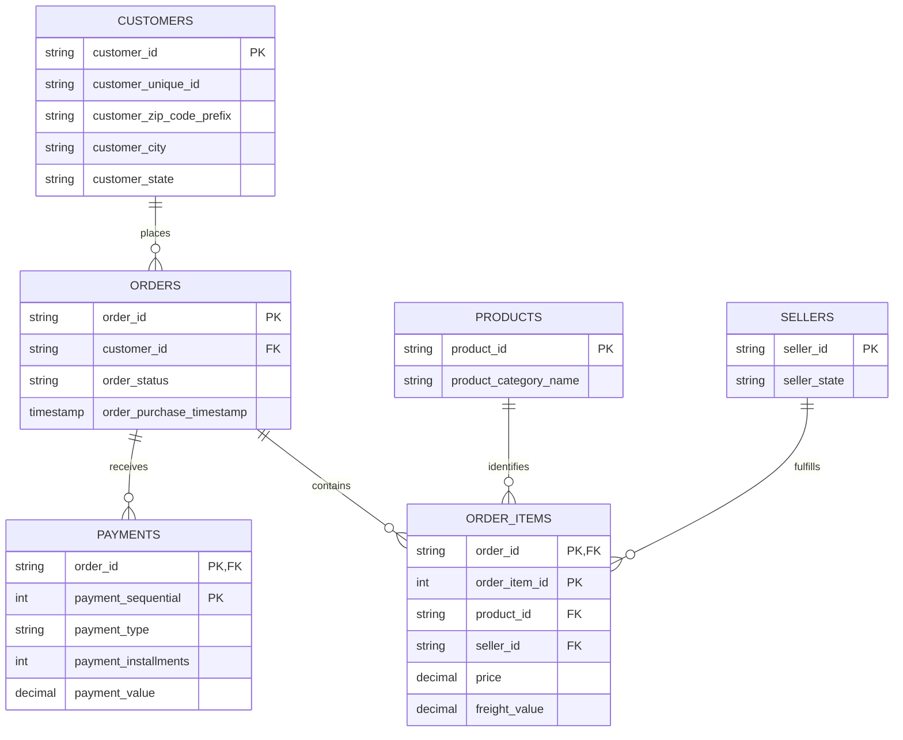

# Logical Data Model

The core analytical model uses six Silver datasets. Reviews, geolocation, and category translation are registered for future extensions but are not required by the current Gold jobs.

## Enforced Silver relationships

- `orders.customer_id -> customers.customer_id`
- `order_items.order_id -> orders.order_id`
- `order_items.product_id -> products.product_id`
- `order_items.seller_id -> sellers.seller_id`
- `payments.order_id -> orders.order_id`

## Gold grains

| Dataset | Grain |
|---|---|
| `sales_by_state` | customer state |
| `sales_by_category` | product category, including `UNKNOWN` |
| `sales_by_payment_type` | payment type |
| `top_customers` | customer unique ID and customer state |
| `top_sellers` | seller ID and seller state |

See [Gold data contracts](../gold-data-contracts.md) for complete column semantics.
